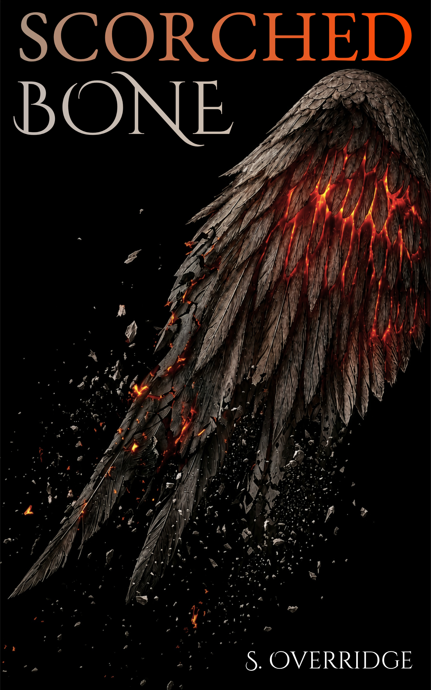
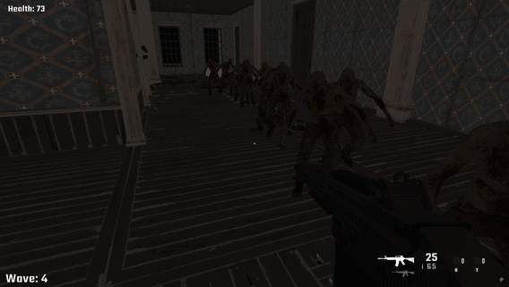

# Hi, I'm Simen 👋

I'm a developer and creative based in Norway, with a background in **game development, programming, video editing, and creative writing**.

I enjoy turning ideas into things people can experience — whether that's a game, a piece of software, a video, or a story.

---

## 📖 Writing & Creative Work

One of my biggest passions outside of programming is **fantasy writing**.

Writing is one of my most important creative projects. I enjoy creating worlds, characters, stories, and visual identities.

| **Bloodied Feather** | **Scorched Bone** |
|:---:|:---:|
|  |  |
| **Available now** | **Coming soon** |
| My completed fantasy novel. | The sequel to *Bloodied Feather*. |
| [**Read the book →**](https://books2read.com/b/bloodied-feather) | |

---

<h3>🔫 FPS Zombie Survival Game</h3>

    My <strong>bachelor's project</strong>, developed entirely by myself.
    It is a <strong>3D first-person zombie shooter</strong> built around
    wave-based survival.

    Players must fight increasingly challenging waves of zombies and survive
    for as long as possible. The goal is ultimately simple:
    <strong>survive the longest</strong>.

    As a solo project, I was responsible for the development of the game
    from concept to implementation, including gameplay programming, enemy
    behaviour, combat systems, player mechanics, and the overall gameplay loop.

    <strong>Focus:</strong>
    <code>Game Development</code> ·
    <code>C#</code> ·
    <code>3D</code> ·
    <code>FPS</code> ·
    <code>Gameplay</code> ·
    <code>Enemy AI</code>

---

## 💻 Programming

I have knowledge and experience with **HTML, CSS, and JavaScript**, with an
interest in using programming to create interactive and functional experiences.

My programming knowledge includes:

`HTML` · `CSS` · `JavaScript`

I've developed my programming skills through my studies and personal work,
particularly in areas related to web development and interactive projects.

---

## 🎬 Video & Visual Work

I also have experience with **video editing, visual design, and Adobe's
creative software**.

I'm knowledgeable in working with Adobe's creative applications and have
experience with areas such as:

- Video editing
- Visual design
- Image editing
- Graphics and composition
- Creative content production

I also designed and created the covers for my fantasy novels myself,
including the visual direction, composition, and final artwork. This has
allowed me to combine my interest in storytelling with visual design.

---

## 🌱 Currently

I'm continuing to develop both my technical and creative skills.

I'm particularly interested in:

- 🎮 Game development
- 💻 Software development
- 📖 Fantasy writing
- 🎨 Visual design
- 🎬 Video editing

---

## 📫 Contact

Feel free to get in touch or take a look at more of my work.

- [GitHub](https://github.com/simenov123)
