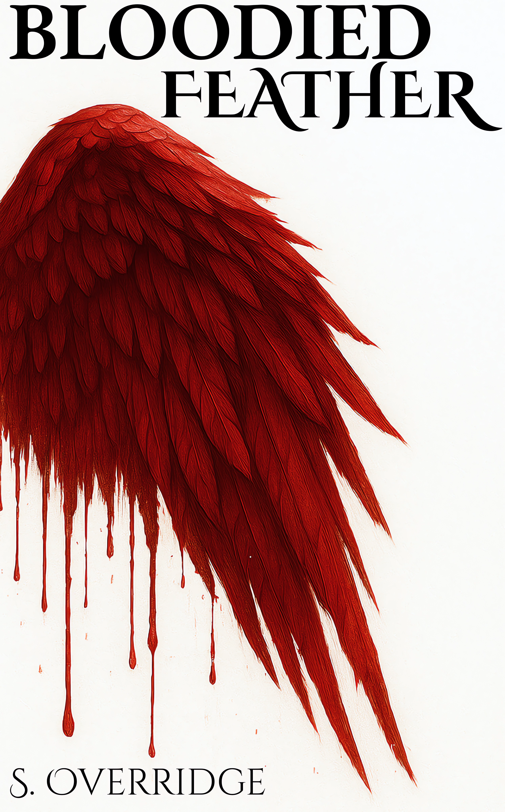

# Hi, I'm Simen 👋

I'm a developer and creative based in Norway, with a background in **game development, programming, video editing, and creative writing**.

I enjoy turning ideas into things people can experience — whether that's a game, a piece of software, a video, or a story.

---

## 📖 Writing & Creative Work

One of my biggest passions outside of programming is **fantasy writing**.

I'm currently working on my own fantasy novel, developing its world, characters, story, and visual identity.

### My Fantasy Novel

A personal project combining:

- ✍️ Creative writing
- 🌎 Worldbuilding
- 🧙 Character development
- 🎨 Visual design
- 📚 Storytelling

The book is one of my largest personal creative projects, and something I continue to develop alongside my technical work.

---

## 🎮 Game Development

During my bachelor's degree, I worked on several game development projects, including **3D first-person shooters and 2D games**.

### 🔫 FPS Game

A 3D first-person shooter developed as part of my studies.

The project involved programming gameplay systems, implementing game mechanics, and developing the overall player experience.

**Focus:**  
`Game Development` · `Programming` · `3D` · `Gameplay`

[View project →](#)

---

### 🕹️ 2D Game

A 2D game developed during my studies.

The project involved programming, game mechanics, and designing the overall gameplay experience.

**Focus:**  
`Game Development` · `Programming` · `2D` · `Game Design`

[View project →](#)

---

## 💻 Programming

Programming is one of my main technical interests.

Through my studies and personal projects, I've gained experience developing software and games while learning how to turn ideas into working applications.

### Technologies

`Python` · `C#` · `JavaScript` · `Git` · `Linux`

You can find more of my projects on my [GitHub profile](https://github.com/simenov123).

---

## 🎬 Video & Visual Work

I've also worked with **video editing and visual content**.

Video has given me another way to communicate ideas and stories, while also developing an interest in pacing, composition, presentation, and visual storytelling.

[View my video work →](#)

---

## 🌱 Currently

I'm continuing to develop both my technical and creative skills.

I'm particularly interested in:

- 🎮 Game development
- 💻 Software development
- 📖 Fantasy writing
- 🎨 Visual design
- 🎬 Video editing

---

## 📫 Contact

Feel free to get in touch or take a look at more of my work.

- [GitHub](https://github.com/simenov123)
- [LinkedIn](https://linkedin.com/in/YOUR-USERNAME)
